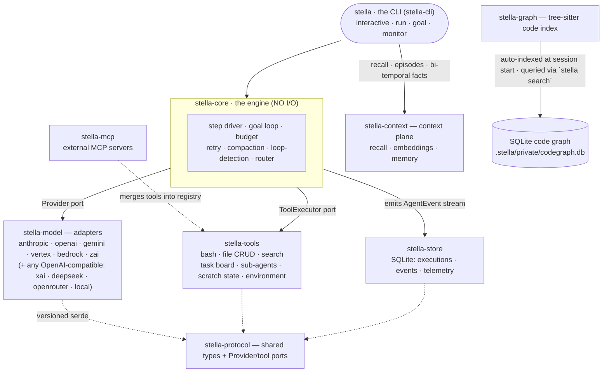

<p align="center">
  <picture>
    <source srcset="docs/brand/logo/svg/lockup-color-light.svg">
    
  </picture>
</p>

<p align="center"><strong>Reference Grade Agent Loop</strong></p>
<p align="center">Open Source · Rust · BYOK · No Phone Home</p>

<p align="center">
  <a href="https://github.com/macanderson/stella/actions/workflows/ci.yml"></a>
  <a href="https://github.com/macanderson/stella/actions/workflows/release.yml"></a>
  <a href="#license"></a>
  
  
</p>

<p align="center">
  <a href="https://stella.oxagen.sh"><b>Website</b></a> ·
  <a href="https://stella.oxagen.sh/docs"><b>Docs</b></a> ·
  <a href="https://stella.oxagen.sh/docs/getting-started/installation"><b>Quickstart</b></a>
</p>

Stella is an open-source, bring-your-own-key (BYOK) coding agent for your
terminal. It runs on every hosted provider in the table below plus any local
OpenAI-compatible server, keeps its telemetry in a local SQLite database, and
enforces a hard per-run budget. Nothing leaves your machine except calls to the
provider you configured — the two paths that would export anything else
(Oxagen Enterprise enrollment, or a `drain` block in `~/.stella/cloud.json`)
exist in no default install. Written in Rust as a workspace of focused crates.

## Features

- **BYOK, auto-detected** — set one provider's API key and Stella finds it.
  Pin a model per run or shell with `--model`.
- **One deterministic step loop** — plan, fan tools out in parallel, observe,
  compact if noisy, repeat. No coordinator, no agent swarm.
- **Opt-in proof of done** — `stella run --pipeline <plugin-id>` hands the turn
  to an installed verification plugin whose oracle authors a test that fails on
  the old code and passes on the new, and tracks that flip. A green suite alone
  is not accepted. The evidence is self-reported: Stella judges it against the
  plugin's declared rule and never re-runs it. Oxagen's Vera is the reference
  plugin, private and not shipped here.
- **Embeddable** — link `stella-core` and supply the `Provider` and
  `ToolExecutor` ports in process. Or drive
  [`stella-serve`](crates/stella-serve/README.md) over HTTP/SSE. Every model
  call, tool call and credential stays on your side of the wire. See
  [Agent Engine in Your App](https://stella.oxagen.sh/docs/agent-engine-in-your-app).
- **Prompt-cache-native memory** — lessons in `.stella/memories/` load once at
  session start into a byte-stable system prompt (~0.1× input cost).
- **Code graph** — a tree-sitter symbol/import index (Rust, TS/TSX/JS, Python,
  Go, Java, C, C++, PHP, SQL) queried by `stella search` instead of grepping.
- **Local-first telemetry** — executions, events, token/cost rows, and the
  files-touched ledger stay canonical in `.stella/private/store.db`.
- **Budget enforcement** — `--spend-limit` aborts cleanly between steps, never
  mid-tool.
- **Goal & fleet modes** — `goal` works in judged rounds; `fleet` fans a task
  DAG out to parallel workers sharing one tree under cooperative file claims,
  or a git worktree each when a task opts in.
- **Lifecycle hooks** — shell-command hooks (`SessionStart`, `PreToolUse`,
  `PostToolUse`) configured in `settings.json`.

## Prerequisites

- **macOS or Linux**, `x86_64` or `arm64`. Private persistence depends on Unix
  owner/mode and no-follow primitives, so non-Unix builds fail closed for
  sensitive state writes and Windows persistence is unsupported.
- `curl`, for the prebuilt or Homebrew install.
- To build from source: **Rust 1.90+** (via [rustup](https://rustup.rs)) and
  `git`. A clone of this repository uses the toolchain pinned in
  `rust-toolchain.toml`, which rustup downloads on the first `cargo build`.
- An API key for any supported provider, _or_ a local OpenAI-compatible server
  (Ollama, vLLM, LM Studio, llama.cpp).

## Install

**Prebuilt binary** — downloads the latest release tarball, verifies its
SHA-256, and falls back to `cargo install` when no prebuilt binary matches your
platform:

```bash
curl -fsSL https://raw.githubusercontent.com/macanderson/stella/main/install.sh | sh
stella --version
```

**Homebrew:**

```bash
brew install macanderson/tap/stella
# from source: brew install --build-from-source ./packaging/homebrew/stella.rb
```

**From cargo** (requires Rust 1.90+ and git):

```bash
cargo install --locked --git https://github.com/macanderson/stella stella-cli
```

**From source:**

```bash
git clone https://github.com/macanderson/stella.git
cd stella && cargo build --release
./target/release/stella --version
```

The `stella-*` crates are **not published to crates.io** (`publish = false` at
`[workspace.package]`, inherited by every member), so the `--git` command above
is the only supported cargo path.

## Set your API key

Stella is BYOK and detects the provider from whichever keys you have set.

| Provider               | Env var                                       | Default model                                                                    |
| ---------------------- | --------------------------------------------- | -------------------------------------------------------------------------------- |
| **OpenRouter**         | `OPENROUTER_API_KEY`                          | `moonshotai/kimi-k3`                                                             |
| **Z.ai** (GLM)         | `ZAI_API_KEY`                                 | `glm-5.2`                                                                        |
| **Anthropic** (Claude) | `ANTHROPIC_API_KEY`                           | `claude-fable-5`                                                                 |
| **OpenAI** (GPT)       | `OPENAI_API_KEY`                              | `gpt-5.5`                                                                        |
| **xAI** (Grok)         | `XAI_API_KEY`                                 | `grok-4.3`                                                                       |
| **DeepSeek**           | `DEEPSEEK_API_KEY`                            | `deepseek-chat`                                                                  |
| **Google Gemini**      | `GEMINI_API_KEY` (alias `GOOGLE_API_KEY`)     | `gemini-3-pro`                                                                   |
| **Google Vertex AI**   | `VERTEX_ACCESS_TOKEN` + `VERTEX_PROJECT_ID`   | `gemini-3-pro`                                                                   |
| **Amazon Bedrock**     | `AWS_ACCESS_KEY_ID` + `AWS_SECRET_ACCESS_KEY` (+ `AWS_REGION`) | `us.anthropic.claude-sonnet-4-5-20250929-v1:0`                  |
| **Local**              | _none_ — pass `--base-url`                    | whatever your server hosts                                                       |

```bash
export ANTHROPIC_API_KEY=your_key_here     # or OPENAI_API_KEY, GEMINI_API_KEY, …
stella models    # list providers, models, and key status
stella config    # show the fully resolved configuration
```

**OpenRouter is checked first**, and it brings a whole posture rather than just
a default model: Kimi K3 driving at `xhigh` with thinking on,
`anthropic/claude-opus-5` judging, `z-ai/glm-5.2` triaging, all on the one key.
Every field composes underneath your own settings, so anything you configure
wins. Its slugs keep their vendor namespace on the wire, so pinning one needs
both halves: `--model openrouter/moonshotai/kimi-k3`.

**Bedrock** authenticates with more than one value — SigV4 needs an access key
id, a secret access key, a region, and a session token for temporary
credentials. `stella auth set bedrock` prompts for the whole set, or
`stella auth set bedrock --stdin --field AWS_REGION=eu-central-1 …` scripts it.
Explicit credentials only: AWS profile files, SSO caches, IMDS/container roles,
and web-identity token files are never consulted, so a Stella process cannot
authenticate as whatever identity its host happens to be carrying. It is also
checked **last**, and only when a secret access key resolves too, because
`AWS_ACCESS_KEY_ID` is exported in plenty of shells for unrelated reasons.
`--model bedrock/…` pins it regardless.

Pin a provider/model per run or shell, or point at a local gateway:

```bash
stella --model anthropic/claude-fable-5 run "refactor the database layer"
export STELLA_MODEL=openai/gpt-5.5
stella --model local/llama3.3 --base-url http://localhost:11434/v1 chat
```

**Z.ai GLM Coding Plan:** set `ZAI_GLM_CODING_PLAN=1` alongside `ZAI_API_KEY`
to route through the dedicated coding endpoint.

**Credential chain** (first hit wins): `--api-key` flag → provider env var →
`settings.json` `api_key` → `~/.stella/credentials.toml` → interactive prompt.
That file is written by
[`stella auth`](https://stella.oxagen.sh/docs/commands/auth) — `auth set`
prompts for a key and masks it, unless you script it with `--key`/`--stdin`;
`auth list` shows every stored key redacted alongside the source that actually
wins; `auth remove` deletes one. It never prints a secret.

**Project `.env` files** — Stella reads `.env`, `.env.local`, and
`.env.<mode>.local` (e.g. `.env.production.local`) from the working directory
or the nearest ancestor in the same git repo, most-specific first. Templates
(`.env.example`, `.env.sample`, `.env.dist`) and non-`.local` mode files
(`.env.production`) are never read. **Your live shell always wins** — an
exported value is never overwritten by a file, so unset a stale export if you
mean to switch. Disable with `STELLA_NO_ENV_FILE=1`; trace it with
`STELLA_ENV_DEBUG=1`.

### Custom providers via `settings.json`

Point Stella at any OpenAI-compatible (or Anthropic/Gemini-dialect) endpoint
without a code change, and override built-in defaults:

| Scope       | Path                                                                                                                           | Wins over         |
| ----------- | ------------------------------------------------------------------------------------------------------------------------------ | ----------------- |
| Project     | `<workspace>/.stella/settings.json`                                                                                            | org-managed, user |
| Org-managed | `/Library/Application Support/stella/settings.json` (macOS) · `/etc/stella/settings.json` (Linux) · `$STELLA_MANAGED_SETTINGS` | user              |
| User        | `~/.stella/settings.json`                                                                                                      | —                 |

```jsonc
{
  "providers": {
    // A brand-new provider: base_url is required, dialect defaults to
    // "openai-compatible" ("anthropic" and "gemini" also available).
    "together": {
      "name": "Together AI",
      "base_url": "https://api.together.xyz/v1",
      "api_key_env": "TOGETHER_API_KEY",
      "default_model": "meta-llama/Llama-3.3-70B-Instruct-Turbo",
    },
    // Overriding a built-in's defaults (e.g. the Z.ai coding plan):
    "zai": { "base_url": "https://api.z.ai/api/coding/paas/v4" },
  },
}
```

Then: `stella --model together/meta-llama/Llama-3.3-70B-Instruct-Turbo run "…"`.
Prefer `api_key_env` over a literal `api_key` — settings files get committed.

> **A repo you just cloned gets nothing until you say so.** Two boundaries,
> both closed by default and both opened by `STELLA_TRUST_PROJECT=1` (or
> `run.auto_trust_project` in a trusted scope).
> *Credential routing:* a project-scope `base_url`, `api_key`, `api_key_env`
> and `mcp.registry_url` are ignored, so a hostile repo cannot point your real
> API key at its own server. Cosmetic fields (`name`, `default_model`,
> `dialect`) still apply, and the user and org-managed scopes are always
> trusted. *Code execution:* project hooks, project `context_providers`, the
> servers in `.stella/mcp.toml`, the plugins in `<workspace>/.stella/plugins`,
> and `stella self-driving`'s issue work each refuse to start from an untrusted
> repo. That list is enumerated once, with the call site gating each surface,
> on `project_code_execution_trusted` in
> [`crates/stella-cli/src/settings.rs`](crates/stella-cli/src/settings.rs) —
> read it there rather than trusting this sentence to stay complete. The legacy
> `STELLA_PROJECT_HOOKS=1` opens the code-execution half alone. Plugins you
> installed yourself with `stella plugin install --scope user` live in
> `~/.stella/plugins` and are unaffected.

### Agent engine config (`agent_engine_config`)

The engine runs a configurable agent per role — **default** (the interactive
step loop) and the pipeline's **worker**, **verifier**, **triage**,
**research**, and **plan**. The `agent_engine_config` object in the same scope
chain sets each one's model, gateway, system prompt, reasoning, and sampling.
In interactive mode `/settings` opens an editor covering all of it (`s` saves
to user scope, `S` to project scope); there are no per-agent slash commands.

```jsonc
{
  "agent_engine_config": {
    // The session's model ("provider/slug", or a bare catalog slug).
    "default_model": "anthropic/claude-fable-5",

    // A model for a role an installed plugin declared, keyed
    // "<plugin-id>/<role>". Unset seats run on the session's model.
    "seat_models": { "vera/verifier": "openrouter/openai/gpt-5.5" },

    // The vocabulary the model pickers offer and auto_mode selects from.
    "allowed_models": ["anthropic/claude-fable-5", "zai/glm-5.2"],

    // "on" picks the verifier automatically from allowed_models (prefer a
    // different family than the worker's, then the highest price tier).
    "auto_mode": "off",
    // "on" chooses per-agent effort for you: verifier high, worker and plan
    // medium, triage and research low, overriding any per-agent "effort".
    "effort_auto": "off",
    // "on" turns thinking on everywhere except triage and research, which
    // read rather than deliberate.
    "reasoning_auto": "off",

    // Per-agent deep config. Every field is optional — set it and it goes on
    // the wire; leave it out and the provider default applies.
    "agents": {
      "verifier": {
        "provider": "openrouter", // gateway: the slug goes to THIS
        "model": "openai/gpt-5.5", // provider verbatim (BYOK per agent)
        "prompt": "You are a strict, evidence-first code verifier.",
        "effort": "high", // low | medium | high | xhigh | max
        "reasoning": "on",
        // temperature · top_p · top_k · frequency_penalty · presence_penalty
        // · repetition_penalty · max_tokens · seed · verbosity · service_tier
        "params": { "temperature": 0.2, "max_tokens": 4096 },
      },
    },
  },
}
```

Precedence per agent: `--model` flag > `agents.<agent>.model` >
`pipeline_<agent>_model` > `default_model` > auto-detect. Research and plan end
that chain at the **worker** instead of `default_model`, so a `--model` that
re-points the worker for one invocation cannot split them onto a second model.
An agent's `provider` field routes its slug through that gateway verbatim, so
the worker can run on your Anthropic key while the verifier routes
`openai/gpt-5.5` through OpenRouter and triage hits Z.ai. Each adapter forwards
only the parameters its wire supports; reasoning maps to GLM's `thinking`,
OpenRouter's `reasoning`, Anthropic extended thinking, OpenAI
`reasoning.effort`, and Gemini `thinkingLevel`. A custom prompt replaces the
built-in base instructions, and workspace memories and rules still append. A
seat whose provider has no resolvable key degrades softly onto the session's
model, with a notice.

## Usage

### Command index

Every command also answers `stella <command> --help`; each row links to its
reference page on [stella.oxagen.sh](https://stella.oxagen.sh/docs/commands).

| Command                                                                     | What it does                                                                                                      |
| --------------------------------------------------------------------------- | ----------------------------------------------------------------------------------------------------------------- |
| [`run <prompt>`](https://stella.oxagen.sh/docs/commands/run)                | Send a one-shot prompt — the raw step loop by default; `--pipeline <plugin-id>` opts into a verification plugin    |
| [`chat`](https://stella.oxagen.sh/docs/commands/chat)                       | Interactive session — also what a bare `stella` opens                                                             |
| [`resume [id]`](https://stella.oxagen.sh/docs/commands/resume)              | Reopen a durable past session exactly where it stood; `--list` browses them                                       |
| [`daemon <cmd>`](https://stella.oxagen.sh/docs/commands/daemon)             | Find, watch, and stop runs that outlived the terminal that started them                                           |
| [`whistle <message>`](https://stella.oxagen.sh/docs/commands/whistle)       | Steer every live non-interactive session on this machine at once                                                  |
| [`goal <goal>`](https://stella.oxagen.sh/docs/commands/goal)                | Work in judged rounds until a verifier model confirms the goal is met                                             |
| [`monitor [target]`](https://stella.oxagen.sh/docs/commands/monitor)        | Watch a branch/PR's CI and fix failures until it is fully green                                                   |
| [`self-driving <cmd>`](https://stella.oxagen.sh/docs/commands/self-driving) | Drive the perpetual delivery loop: plan a cycle, fold the ledger, advance the audit                               |
| [`fleet <tasks…>`](https://stella.oxagen.sh/docs/commands/fleet)            | Fan tasks out to worker agents, wave-scheduled and recorded in a ledger                                           |
| [`init`](https://stella.oxagen.sh/docs/commands/init)                       | Infer this workspace's domain taxonomy and build the code-graph index                                             |
| [`search <query>`](https://stella.oxagen.sh/docs/commands/search)           | Find code by meaning or by name over the code-graph index                                                         |
| [`storage <cmd>`](https://stella.oxagen.sh/docs/commands/storage)           | Inspect the storage map: layers, namespaces, relations, fields, drift (offline)                                   |
| [`tools`](https://stella.oxagen.sh/docs/commands/tools)                     | List every tool available this session; `--validate` checks custom manifests                                      |
| [`commands <cmd>`](https://stella.oxagen.sh/docs/commands/commands)         | List this workspace's custom slash commands, or convert markdown ones to TOML                                     |
| [`skill run <slug>`](https://stella.oxagen.sh/docs/commands/skill)          | Run a skill as a scoped one-shot (`stella skill run <slug>`)                                                      |
| [`plugin <cmd>`](https://stella.oxagen.sh/docs/commands/plugin)             | Install, list, and remove plugins — `install` shows the declaration before it acts                                |
| [`models`](https://stella.oxagen.sh/docs/commands/models)                   | List configured providers and available models                                                                    |
| [`auth <cmd>`](https://stella.oxagen.sh/docs/commands/auth)                 | Manage BYOK provider keys in `~/.stella/credentials.toml` — never prints a secret                                 |
| [`config`](https://stella.oxagen.sh/docs/commands/config)                   | Show the fully resolved configuration                                                                             |
| [`migrate <cmd>`](https://stella.oxagen.sh/docs/commands/migrate)           | Move a `settings.json` to `stella.toml`; the JSON is kept, never deleted                                          |
| [`mcp <cmd>`](https://stella.oxagen.sh/docs/commands/mcp)                   | Manage MCP servers: search a registry, install, list, log in, show usage                                          |
| [`memory <cmd>`](https://stella.oxagen.sh/docs/commands/memory)             | Inspect memories; promote one to a project rule                                                                   |
| [`ingest [paths…]`](https://stella.oxagen.sh/docs/commands/ingest)          | Turn markdown you already wrote — `AGENTS.md`, design notes — into steering                                       |
| [`context <cmd>`](https://stella.oxagen.sh/docs/commands/context)           | Review, publish, and explain the context records that steering ingested                                           |
| [`stats`](https://stella.oxagen.sh/docs/commands/stats)                     | Cost, tokens, and $/resolved task for **this** workspace                                                          |
| [`usage <cmd>`](https://stella.oxagen.sh/docs/commands/usage)               | The same numbers across **every** project, from the hub at `~/.stella/usage.db`                                   |
| [`scoreboard`](https://stella.oxagen.sh/docs/commands/scoreboard)           | What the work cost, and whether a merged or closed PR implies anyone called it good                               |
| [`calibration`](https://stella.oxagen.sh/docs/commands/calibration)         | Pass calibration: how often a pass verdict later failed CI, or was reverted                                       |
| [`inspect`](https://stella.oxagen.sh/docs/commands/inspect)                 | Replay the exact context a past model call was sent, verified against its digests                                 |
| [`observe`](https://stella.oxagen.sh/docs/commands/observe)                 | Serve the Observatory dashboard over local telemetry — loopback-only, read-only                                   |
| [`cloud <cmd>`](https://stella.oxagen.sh/docs/commands/cloud)               | Show or set the org/workspace identity that scopes replicated telemetry                                           |
| [`telemetry <cmd>`](https://stella.oxagen.sh/docs/commands/telemetry)       | Inspect or flush the managed enterprise spool — off unless explicitly enrolled                                    |
| [`tune <cmd>`](https://stella.oxagen.sh/docs/commands/tune)                 | A/B one policy knob over two loop-bench result files; `--promote` is reversible                                   |
| [`dataset <cmd>`](https://stella.oxagen.sh/docs/commands/dataset)           | Curate a redacted training dataset from this workspace's own receipts                                             |
| [`arena`](https://stella.oxagen.sh/docs/commands/arena)                     | [arena-bench](https://github.com/macanderson/arena-bench) harness adapter — for benchmarking Stella, not using it |
| [`doctor`](https://stella.oxagen.sh/docs/commands/doctor)                   | Diagnose the install: config, credentials, toolchain, and workspace state                                         |
| [`proposals <cmd>`](https://stella.oxagen.sh/docs/commands/proposals)       | Review the adaptive-context loop's pending proposals — keep, ignore, or retire                                    |
| [`completions <shell>`](https://stella.oxagen.sh/docs/commands/completions) | Print a shell completion script to stdout (bash, zsh, fish, powershell, elvish)                                   |
| [`version`](https://stella.oxagen.sh/docs/commands/version)                 | Print the version and exit                                                                                        |

### Interactive mode (default)

```bash
stella            # or: stella chat
```

On a terminal this opens the tabbed interactive interface (Session · Agents ·
Traces · Graph · Files · Skills · MCP · Issues · Settings) with PR-style diffs
and an editable prompt queue.

`--accessible` (or `STELLA_ACCESSIBLE=1`) runs the same interface for a screen
reader. It draws inline on your own screen. Each finished message goes into
normal scrollback exactly once. Panels become single columns, rows replace
tables, and every tab, overlay, or focus change is spoken. `--plain` (or
`STELLA_PLAIN=1`, or piped stdio) falls back to the line-oriented prompt.

**In-chat commands** — the two surfaces implement their own vocabularies, so
the surface column says where a command actually works:

| Command                                                                                  | Surface        | Does                                                                                                                            |
| ---------------------------------------------------------------------------------------- | -------------- | --------------------------------------------------------------------------------------------------------------------------------- |
| `/help` `/clear`                                                                         | both           | Show help · clear history                                                                                                       |
| `/info`                                                                                  | both           | List providers/models (`/info refresh` re-syncs the catalog; the old `/models` name still routes)                               |
| `/init` `/agents`                                                                        | both           | Reindex the workspace · the installed custom agents                                                                             |
| `/model`                                                                                 | tabbed only    | Switch **this session's** model; `/model default <spec>` persists the default instead                                           |
| `/agent`                                                                                 | tabbed only    | Run as an installed agent this session — persona, `tools:` scope, and declared `model:` all apply                                |
| `/files`                                                                                 | tabbed only    | The Files-Touched ledger — `[C·R·U·D] path` per file                                                                            |
| `/settings` `/diff` `/graph` `/skills` `/mcp` `/mcp-search` `/sessions` `/context` `/inspect` `/inbox` | tabbed only | Open the corresponding tab or overlay (`/settings` includes the engine-config editor)                              |
| `/export`                                                                                | tabbed only    | Export session telemetry to a ZIP + HTML dashboard                                                                              |
| `/goal <text>` `/config`                                                                 | line-oriented  | Work in judged rounds until the goal is met · show resolved configuration                                                        |
| `/rename <name>` `/color <name>`                                                         | line-oriented  | Rename the tab · switch accent color                                                                                            |
| `/exit` or `Ctrl-D`                                                                      | line-oriented  | Exit (the tabbed interface exits with `Ctrl-C`)                                                                                 |

### One-shot, goal, and fleet runs

```bash
stella run "fix the failing test in src/auth.rs"

stella goal "the login flow has a passing e2e test and CI is green"
stella monitor main          # drive a branch/PR's CI to green as a judged goal

stella fleet "fix the flaky auth test" "tighten the CI cache key"
stella fleet --plan .stella/fleet.toml --max-concurrency 2 --spend-limit 5.0
```

Fleet tasks are wave-scheduled by dependency and recorded in
`.stella/private/fleet.db`. Workers share the repository root by default,
coordinated by cooperative file claims; a task with `isolation = "isolated"`
gets its own git worktree under `.stella/worktrees/` on a
`fleet/<slug>-<hash>` branch. A plan file is the serde form of the fleet DAG:
`[[tasks]]` entries with `id`, `title`, `prompt`, optional `depends_on`, and
`isolation`.

### Code graph and introspection

```bash
stella init      # domain taxonomy (.stella/domains.toml) + the code-graph index
stella search "where is run_turn defined"    # a symbol name works as well as a sentence
stella search "what imports src/auth.rs"     # blast radius before you edit it
stella tools     # every tool available to the agent this session
stella stats     # cost, tokens, $/resolved task (--format table|json|csv)
stella inspect   # the exact context a past model call was sent, from receipts
```

The index is built by `stella init`, ranked offline by name/graph match when no
embedder is configured, and by meaning when one is.

### Global flags

`--model provider/id` · `--api-key` · `--base-url` · `--spend-limit <usd>` ·
`--accessible` · `--plain` · `--no-anim` (also as `STELLA_MODEL`,
`STELLA_BASE_URL`, `STELLA_SPEND_LIMIT`, `STELLA_ACCESSIBLE`, `STELLA_PLAIN`,
`STELLA_NO_ANIM`). All are registered with every subcommand, so they parse
before _or_ after the subcommand token.

`--output-format text|json|stream-json` (env `STELLA_OUTPUT_FORMAT`) is not
global: it is declared by the commands that honor it — `stella run` and
`stella fleet` — and goes after the subcommand token
(`stella run "…" --output-format json`). Interactive `chat` / `goal` / `monitor`
render for a human instead.

**Verification flags.** `stella run` runs the raw step loop by default;
`--pipeline <plugin-id>` opts into an installed verification plugin, whose own
`[oracle]` decides how the work is proven ([the inference
pipeline](https://stella.oxagen.sh/docs/inference-pipeline) documents the design
and the plugin path). `--pipeline classic` named a built-in staged pipeline
that no longer exists in this workspace and is now refused outright, as are
`--keep-witness` and `--require-verified`; `--test-command` is refused on the
raw loop but passes through to a named plugin's oracle. Every refusal names
`stella plugin install` as the remedy. `--no-pipeline` is a no-op kept
parseable so no script breaks.

Post-turn reflection stays on for one-shot text, JSON, and stream-JSON runs.
Ephemeral automation suppresses that extra model call with
`STELLA_DISABLE_REFLECTION=1` (`true`, `yes`, and `on` also work,
case-insensitively).

## Built-in tools

Declared once in `crates/stella-tools/src/catalog.rs`, which is the list. The
shell, file CRUD and search are the working surface; the rest coordinate.

| Tool                                                                                         | Description                                                                                                                                                                    |
| -------------------------------------------------------------------------------------------- | -------------------------------------------------------------------------------------------------------------------------------------------------------------------------------- |
| `bash`                                                                                       | Run a shell command in the workspace root, stdout+stderr with a timeout backstop — the one built-in that runs something nobody bounded                                          |
| `read_file` · `write_file` · `edit_file` · `delete_file`                                     | File CRUD confined to the workspace: numbered reads over an offset/limit window, whole-file writes, exact-substring edits that refuse an ambiguous match, and a delete that removes a symlink as the link rather than its target |
| `search`                                                                                     | Find code by meaning as well as by text — one call returns the answering files with their symbols, callers, imports and source attached, and always states which strategies ran and whether it truncated |
| `task_create` · `task_list` · `task_start` · `task_complete` · `task_cancel` · `task_assign` | The session task board — one row per deliverable, exactly one in progress; `task_assign` hands a board task to a parallel sub-agent                                             |
| `delegate`                                                                                   | Hand a self-contained research question to a read-only sub-agent that returns only its findings, keeping bulky evidence out of the parent conversation. Independent questions dispatched in one step run concurrently |
| `save_state` · `get_state` · `list_state` · `delete_state`                                   | Session-private key/value scratch (parse results, extracted lists, computed digests) saved once and referenced later instead of re-derived — paged reads by byte offset, deleted at session end |
| `get_environment`                                                                            | Report the session's environment: workspace root, git status, platform/arch, OS release, shell dialect, and the scratch directory path                                          |
| `ask_question`                                                                                | Put a decision back to whoever is driving the agent — a person at a terminal, or the parent that delegated the work                                                             |

Every built-in is registered by default and individually withholdable with a
`"tools": {"<name>": "off"}` switch in any `settings.json` scope (normal
per-field merge — project wins). Everything beyond the built-ins reaches the
registry from outside: MCP servers (`.stella/mcp.toml`) and developer-defined
custom script tools (`.stella/tools/*.toml`).

**Containment is the process boundary, not a per-tool sandbox.** `bash` runs a
shell, and custom manifest tools and hook actions spawn processes around it, so
no per-tool boundary covers them all — one that covered only `bash` would claim
a session-wide bound it does not have. For real containment, run the whole
Stella process inside a container, where the boundary sits outside every spawn
path. See [`docs/spec/remote-sandboxes.md`](docs/spec/remote-sandboxes.md).

## Memory and context

Lessons written as markdown in `.stella/memories/` load once at session start
into a byte-stable system prompt, so every model call considers them at
prompt-cache prices. New memories take effect the next session — hot-injection
would invalidate the cache.

Every working turn is also recorded as an **episode** (summary, files touched,
outcome, time window) in `.stella/private/context.db`, and `stella init` writes
the domain taxonomy as bi-temporal facts. Recall fans out through the Context
Graph Protocol host to the memory store and the code graph, fused by score
under one budget.

## Telemetry

Executions are recorded, best-effort, in `.stella/private/store.db`: the full
event stream, per-model-call rows (tokens, cache hits, cost), and the
Files-Touched ledger. The store is never a dependency of a turn — a session
runs even if the file cannot be opened. Query it with any SQLite client.

A default install constructs no telemetry spool and no telemetry HTTP client,
so nothing is sent anywhere. Two configurations, and only these two, change
that:

- **The `cloud.json` drain** —
  [`stella cloud sync`](https://stella.oxagen.sh/docs/commands/cloud), a
  separate pipe with its own wire contract and endpoint, inert unless the file
  carries both an `org_id` and a `drain` block.
- **Oxagen Enterprise enrollment** — a valid signed `enterprise_telemetry`
  document in the org-managed settings scope, binding issuer, audience,
  organization/workspace, expiry, the single `execution_rollup` event class, a
  managed model catalog, `process_free` isolation, bearer-secret references,
  and one endpoint matching the administrator's HTTPS allowlist exactly.

While enrolled, only a raw `stella run` is eligible. Every other execution
surface — a `--pipeline` run, goal, fleet, and interactive — is rejected,
because a wrapper of any kind spawns a process the `process_free` boundary is
drawn to exclude (`ExecutionSurface` in
`crates/stella-cli/src/enterprise_telemetry.rs` is the list). An eligible run
exports managed identifiers, an allowlisted
provider/model or `other`, outcome, duration, input and output token counts,
cost in micro-USD, tool-call and changed-file counts, and a produced-output
boolean. Prompts, paths, tool names/arguments/results, reasoning, errors, git
state, memories, rules, full local events, and local execution or installation
identifiers are excluded.

Delivery is at-least-once from an owner-only host spool outside the workspace,
bounded to 10,000 rows and 16 MiB. Startup flush is detached and never delays
execution or exit; `stella telemetry flush` attempts one bounded batch, and
`stella telemetry status` reports enrolled state, pending and stranded
rows/bytes, quarantine and physical size, and durable drop, corruption, and
rollover counters. The
[telemetry documentation](https://stella.oxagen.sh/docs/telemetry) covers
backfill, retry, rollover, and the server-side companion.

## Lifecycle hooks

Declare shell-command hooks in any `settings.json` scope; they fire on agent
lifecycle events, receiving the event payload as JSON on stdin:

```jsonc
{
  "hooks": {
    "SessionStart": [
      { "hooks": [{ "command": "echo \"on-call: $(cat .oncall 2>/dev/null)\"" }] },
    ],
    "PreToolUse": [
      {
        "matcher": "task_assign",
        "hooks": [{ "command": "./scripts/guard-delegation.sh", "timeoutMs": 5000 }],
      },
    ],
  },
}
```

- **`SessionStart`** — stdout is appended to the system prompt as session
  context, once per session.
- **`PreToolUse`** — a non-zero exit blocks the tool and the model sees the
  hook's message instead. `matcher` is a glob over the tool name.
- **`PostToolUse`** — observation only, never blocks.

Scopes concatenate: any scope can add a gate, none can remove another's. Hooks
from a repo's own `.stella/settings.json` load only under
`STELLA_TRUST_PROJECT=1` (or the legacy `STELLA_PROJECT_HOOKS=1`), so cloning
an untrusted repo never auto-executes its commands.

## Architecture

`stella-core` has no I/O of its own: it drives model calls through the
`Provider` port and tools through the `ToolExecutor` port, emitting an
`AgentEvent` stream over a channel. All decision logic — compaction, eviction,
loop detection, budget — is plain synchronous functions over owned data, so a
new vendor or tool is an adapter, never a rewrite.



## Design principles

The architectural rules that hold the design together: the engine drives
everything through ports and does no I/O; every cross-boundary type round-trips
through `serde_json` byte-for-byte; errors are typed rather than panicked; the
budget aborts only between steps and never mid-tool; prompts stay byte-stable
so the provider cache keeps hitting; provider feature parity is declared and
witness-tested rather than assumed; every emitted signal names what consumes
it; every way Stella changes itself is declared — and Stella sends **zero
telemetry anywhere** by default.

They are stated normatively, in full, in
[AGENTS.md § Architecture: ports, not direct dependencies](AGENTS.md#architecture-ports-not-direct-dependencies).
That is the only copy; this section summarizes and does not govern. A PR that
breaks one of them will be asked to restructure regardless of how good the
feature is.

Stella is also **BYOK** — any provider key, any combination, no account. That
is a product property rather than an architectural rule, but it is the one most
people want to know first.

## Workspace layout

The crates below make up the workspace. The Context Graph Protocol (CGP) — the
retrieval abstraction Stella's recall routes through — lives in its own
repository and is pulled in as registry crates pinned to exact versions in the
root `[workspace.dependencies]`, not as workspace members.

Every crate carries its own `README.md`, linked below, with its file layout,
the rules it enforces, its gotchas, and the recipe for extending it.

| Crate                                                       | Role                                                                                                                                                       |
| ----------------------------------------------------------- | ------------------------------------------------------------------------------------------------------------------------------------------------------------ |
| [`stella-cli`](crates/stella-cli/README.md)                 | The shipping binary — clap surface plus agent-loop wiring                                                                                                  |
| [`stella-core`](crates/stella-core/README.md)               | The step-driver engine, no I/O: parallel tools, goal loop, budget, retry, compaction, loop detection, router                                                |
| [`stella-records`](crates/stella-records/README.md)         | The context-record plane: the typed record taxonomy, the ingestion boundary, and the registry that merges markdown rules and TOML records. No I/O          |
| [`stella-tools`](crates/stella-tools/README.md)             | The built-ins, every one registered by default and each withholdable via `tools` switches                                                                   |
| [`stella-model`](crates/stella-model/README.md)             | The `Provider` port's adapters: anthropic, openai, gemini, vertex, bedrock, zai — SSE, tool-call dialects, SigV4, pricing                                   |
| [`stella-store`](crates/stella-store/README.md)             | SQLite persistence: executions, events, telemetry, files-touched                                                                                            |
| [`stella-mcp`](crates/stella-mcp/README.md)                 | MCP client (stdio + HTTP, protocol `2025-06-18`) merging external tools into the registry                                                                   |
| [`stella-protocol`](crates/stella-protocol/README.md)       | Zero-logic, zero-I/O stability contract: shared serde types plus the `Provider`/tool ports                                                                  |
| [`stella-context`](crates/stella-context/README.md)         | The context plane: reflection-memory recall, embedding index, episodes, bi-temporal facts                                                                   |
| [`stella-graph`](crates/stella-graph/README.md)             | Tree-sitter symbol + import-edge indexer (Rust/Python/JS/TS/TSX/SQL/Go/Java/C/C++/PHP)                                                                      |
| [`stella-fleet`](crates/stella-fleet/README.md)             | The multi-agent fleet behind `stella fleet`: DAG planner, wave scheduling, cooperative file claims, opt-in git-worktree isolation per task                  |
| [`stella-tui`](crates/stella-tui/README.md)                 | The interactive interface — a pure event-fold core plus a thin crossterm shell                                                                              |
| [`stella-tui-theme`](crates/stella-tui-theme/README.md)     | The v2 palette, state glyphs and wordmark, plus the hue clamp holding them — a near-leaf every surface can take                                             |
| [`stella-observatory`](crates/stella-observatory/README.md) | `stella observe`'s loopback-only telemetry dashboard over the local SQLite stores                                                                           |
| [`stella-serve`](crates/stella-serve/README.md)             | A separate binary, not part of the `stella` CLI: drives the engine over a wire protocol so a host runs the Rust core, remoting every model and tool call back — the engine holds no ambient authority |
| [`stella-diag`](crates/stella-diag/README.md)               | Typed, content-free records explaining *why* the program did something — a `serde`-only leaf any crate may depend on                                        |
| [`stella-home`](crates/stella-home/README.md)               | Where `~/.stella` is: user home, stella home, user-tier data dir. A leaf with **no dependencies at all**, so `stella-store` and `stella-observatory` can both take it |
| [`stella-engine`](crates/stella-engine/README.md)           | Step-scoped facade over `stella-core` for durable hosts: `run_step` plus checkpoint/resume, re-exports only — used by `stella-serve`, never by the CLI      |
| [`stella-runtime`](crates/stella-runtime/README.md)         | The shared engine-assembly bottom half (`RuntimeSpec` → `SessionRuntime`) and the wrapper socket; construction only, reading no ambient environment by contract |
| [`stella-parity`](crates/stella-parity/README.md)           | The CLI-vs-API capability matrix: every capability declares a witnessed posture on both surfaces, so a feature cannot ship on one and silently miss the other |
| [`stella-autonomy`](crates/stella-autonomy/README.md)       | The self-driving loop's decision core: AIMD controller, aperture ladder, dry-streak oracle, ledger folds — pure, shared by the CLI and the Observatory      |
| [`stella-diff`](crates/stella-diff/README.md)               | A pure line-oriented unified diff with git's exact hunk shape and no dependencies                                                                           |
| [`stella-embed`](crates/stella-embed/README.md)             | The embedding seam: the `Embedder` trait, the fingerprint stamped on every stored vector, and cosine ranking                                                |
| [`stella-plugin`](crates/stella-plugin/README.md)           | Parses and validates a plugin's manifest and the wrapper socket's wire shapes, with no I/O                                                                  |
| [`stella-transcript`](crates/stella-transcript/README.md)   | The shared transcript model plus its two renderers: HTML for the Observatory, a character grid for the terminal                                             |
| [`stella-tty`](crates/stella-tty/README.md)                 | A no-dependency leaf answering whether a human is around to see and answer a prompt                                                                        |
| Context Graph Protocol                                      | Its own project: [macanderson/context-graph-protocol](https://github.com/macanderson/context-graph-protocol) — wire types, host runtime, public conformance suite. Stella is its reference host and depends on it as exact-version registry crates. |

Alongside the Rust workspace, the documentation site
([stella.oxagen.sh](https://stella.oxagen.sh)) lives at `website/` (Next.js +
Fumadocs) as a **self-contained** package: its own `package.json`,
`pnpm-lock.yaml`, and pnpm settings all sit in that directory, and the repo
root is pure cargo. The two toolchains share no code — the one thing crossing
between them is the brand palette: `crates/stella-tui/src/palette.rs` is the
hand-maintained normative source, mirrored by `website/src/app/tokens.css`
(`--stella-*`), and the two must be edited together.

## Development

```bash
cargo build --workspace
cargo test --workspace
cargo clippy --workspace --all-targets -- -D warnings
cargo run -p stella-cli -- models
```

`make gate` runs everything CI enforces, and `make hooks` installs it as a
pre-push hook — see [AGENTS.md § The gate](AGENTS.md#the-gate--what-every-push-is-held-to).

### The docs site

```bash
cd website       # the site is self-contained; the repo root is pure cargo
pnpm install     # once (Node ≥ 20, pnpm 11)
pnpm dev         # serve the docs at http://localhost:3400
pnpm build       # production build (what docs.yml CI runs)
```

Docs content is MDX under `website/content/docs/`. On a pull request a
docs-only change runs the fast `docs` workflow and `ci.yml`'s Rust jobs skip
themselves after a cheap diff check — their required contexts still report, as
`skipped`, so the PR can merge. Once queued or pushed to `main` the same jobs
always run the full gate, since the required check has to report on the merged
result.

To try your working copy against real projects before a release, install it as
`stella-dev`, which lives side by side with the released `stella`:

```bash
scripts/dev.sh install        # build (release) + link ~/.local/bin/stella-dev
cd ~/any/other/repo && stella-dev
scripts/dev.sh status         # show what both binaries resolve to
scripts/dev.sh uninstall      # remove the link
```

## Contributing

Contributions are welcome. Stella is AGPL-3.0-only and dual-licensed, so a
one-time [CLA](CLA.md) signature is required — you keep your copyright, and the
bot walks you through it on your first PR. See
[`CONTRIBUTING.md`](CONTRIBUTING.md) for dev setup, a tour of the crates, the
witness-test contract, and style rules. CI runs `fmt`, `clippy -D warnings`,
tests, and a release build on every PR.

| You have…  | Do this                                                                                                                                                                            |
| ---------- | ---------------------------------------------------------------------------------------------------------------------------------------------------------------------------------- |
| A bug      | [File it with a repro](https://github.com/macanderson/stella/issues/new?template=bug_report.yml)                                                                                   |
| An idea    | [Open a feature request](https://github.com/macanderson/stella/issues/new?template=feature_request.yml) or start a [discussion](https://github.com/macanderson/stella/discussions) |
| An evening | Grab a [`good first issue`](https://github.com/macanderson/stella/issues?q=is%3Aissue+is%3Aopen+label%3A%22good+first+issue%22)                                                    |

## License

Stella is **dual-licensed**.

**Open source: [AGPL-3.0-only](LICENSE).** Free to run, read, modify, and
redistribute. In exchange, if you distribute a modified Stella — or offer one
to users over a network — you publish your modifications under the same terms.
Using Stella as a coding tool on your own proprietary codebase is unaffected:
the AGPL covers Stella itself, not the code you write with it.

**Commercial: [available from Oxagen](LICENSING.md).** If you want to embed
Stella in a closed-source product, run a modified Stella as a hosted service
without publishing it, or your procurement process forbids AGPL code, a
commercial license removes those obligations. Contact <licensing@oxagen.sh>.

[`LICENSING.md`](LICENSING.md) explains which track you are on and why. The
[Context Graph Protocol](https://github.com/macanderson/context-graph-protocol)
is a separate project and stays permissive — **MIT OR Apache-2.0**, at your
option — so depending on it does not put your project under the AGPL.

Contributions require a [CLA](CLA.md); you keep your copyright.
