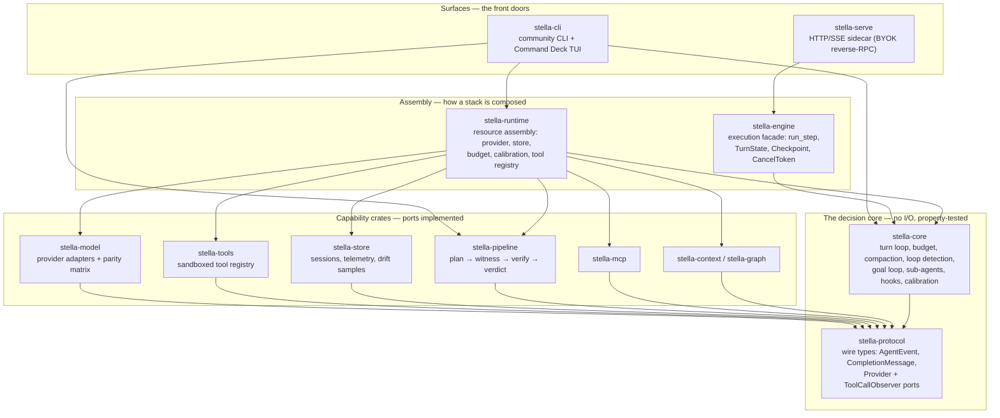
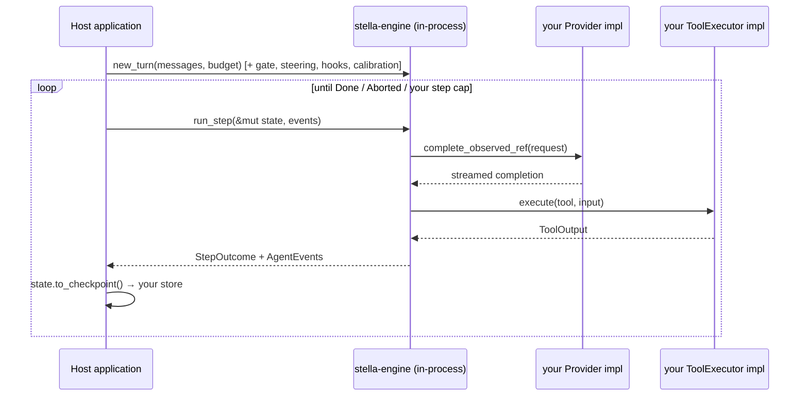
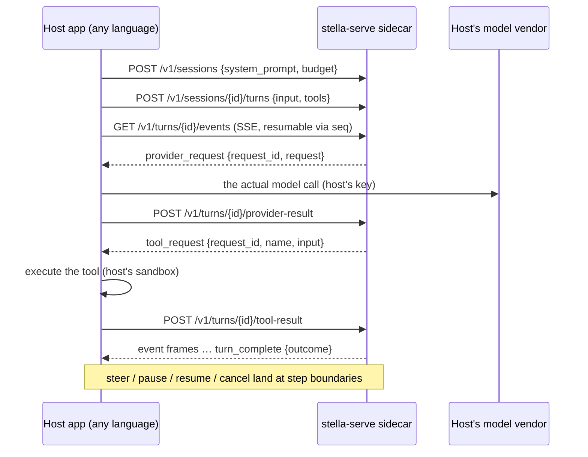

# Stella as an embeddable gen-AI engine — architecture, surfaces, and the parity contract

**Status:** descriptive of the tree as of 2026-08, plus a gap register. The
enforcement half — the cross-surface capability matrix — ships with this
document as the `stella-parity` crate and runs in `cargo test --workspace`.
**Companion docs:** `docs/design/serve-surface.md` (the API surface in
detail), `AGENTS.md` (the numbered architectural invariants this document
assumes).

Stella is heading three places at once, and all three consume the same
engine:

1. **An embeddable engine** for companies building AI-agent applications —
   Stella supplies the turn loop, verification, budgeting, and context
   discipline; the host supplies keys, tools, and product.
2. **A CLI that grows an API surface** — `stella` the tool and `stella-serve`
   the sidecar are two front doors to one machine.
3. **A community edition of a commercial product** — which raises the bar on
   inspectability: every layer has to be readable, testable, and integrable
   on its own.

The risk in that plan is not building the engine — it exists — it is the two
front doors drifting apart. This document maps the machine, the three ways a
host can drop it into an application, the parity system that keeps the doors
honest, and the gaps between today's tree and the embedding story.

---

## 1. The machine: one engine, layered ports, two front doors

Every arrow points at a dependency. The load-bearing property (AGENTS.md
invariant 1) is that arrows only ever point *down*: the decision core is
plain synchronous logic over owned data, and everything that touches the
world — models, processes, files, sockets — arrives through a port trait
implemented above it.

Read the assembly layer carefully, because it is where the current tree is
weakest: **the two halves of issue #971 never converged.** `stella-runtime`
(resource assembly) is consumed only by the CLI — and only its `parts::*`
free functions; its `RuntimeBuilder`/`SessionRuntime` composite has zero
production call sites. `stella-engine` (execution facade) is consumed only by
serve; the CLI still drives `stella-core` directly. So the diagram above is
the *intended* shape; today each surface uses one assembly crate and
re-implements the other's half by hand. Gap G1 below.

---

## 2. Three ways to drop Stella into an application

### Mode A — in-process Rust library (deepest integration)

For a Rust host (or anything that can FFI into one): link `stella-engine`
and drive steps yourself. You own the loop, the persistence, and both ports.

What you get for free at this layer: the step-boundary contract (cancel,
pause, steer — never mid-tool), compaction and prompt-cache discipline,
loop detection, budget enforcement, drift calibration, the goal loop and
sub-agents, and a serde `Checkpoint` that resumes in another process.
What you owe: the loop bound (`engine.max_steps()` — see the crate docs'
canonical example), event handling, and persistence.

Licensing note for this mode: linking the AGPL-3.0-only crates in-process
carries AGPL obligations for the combined work; the commercial track exists
for hosts who need different terms. Mode B is the arms-length alternative.

### Mode B — sidecar API (`stella-serve`, language-agnostic)

The host runs the `stella-serve` binary and talks HTTP/SSE. The defining
property is **bring-your-own-everything via reverse RPC**: the sidecar never
holds provider keys and never executes tools — it emits `provider_request` /
`tool_request` frames and the *host* answers them. Stella supplies the turn
discipline; the host keeps custody of secrets and side effects.

Wire contract artifacts already exist: `docs/wire/serveframe.schema.json`,
`serveinbound.schema.json`, and `serveframe.d.ts`, drift-gated by
`scripts/check-wire-schema.sh`.

### Mode C — the community CLI (the reference host)

`stella` itself is Mode A taken to its richest conclusion: the CLI is the
one host that wires *everything* — pipeline verification, memory, skills,
MCP, fleet, the deck. Treat it as the living reference implementation for
what a full embedding looks like; the parity matrix below is what keeps the
API surface from quietly falling behind it.

---

## 3. The parity contract: features ship on both surfaces, or the absence is declared

The failure mode this repo already solved once for providers —
"per-provider divergence nothing enforced" (`crates/stella-model/src/provider_parity.rs`)
— exists one level up, between surfaces. Measured on the tree at the time of
writing: the API could set exactly **one** of `EngineConfig`'s ~15 tuning
knobs (`max_steps`); the goal loop, sub-agents, hooks, and calibration were
CLI-only; and serve's own route tests hand-listed 7 of its 14 routes.

The fix is the same instrument, promoted a level: **`stella-parity`**, a
workspace crate holding one `Capability` row per engine capability, each row
declaring a posture on every surface:

| Posture | Meaning | What the tests check |
|---|---|---|
| `Shipped { mechanism, witness }` | wired on this surface | the named witness test exists in that surface's sources |
| `ShippedUnwitnessed { mechanism, missing }` | wired, but no test pins the wiring | counted against `UNWITNESSED_BASELINE`, a ratchet pinned by exact equality |
| `Deferred { waiting_on }` | not there yet, deliberately | the reason is written down where review can see it |
| `NotApplicable { reason }` | never meant to be there | the design reason is written down |

Completeness is enforced **from both ends**, so the matrix cannot silently
lag reality:

- every real API route (`Route::ALL`, added to `stella-serve` with a
  compile-enforced classifier) must be claimed by a row — a new route
  without a matrix decision fails `cargo test --workspace` in the PR that
  adds it;
- every public `Engine` entry point in the driver/goal modules must be
  claimed by a row or by the composition-seam allowlist — a new engine
  capability without a matrix decision fails the same way.

**The law** (mirroring the provider matrix's): adding an engine capability,
an API route, or an agent-facing CLI behavior means updating the matrix in
the same PR. `Deferred` is an honest and expected answer. The matrix's job
is to make sure a human wrote the answer down where a test keeps it true.

What this deliberately does **not** do yet: sweep the CLI's clap tree into
the matrix (the CLI's 34 commands are mostly offline introspection; mapping
them all is noise), or verify *behavioral* equivalence between surfaces
(that needs the harness described in G8). Both are declared follow-ups, not
silent omissions.

---

## 4. Gap register — between today's tree and the embedding story

Ordered by how much they matter to an embedding customer. Each is verified
against the tree, not aspirational.

**G1 — The split-brain assembly layer.** `stella-runtime` is CLI-only (and
only its `parts::*`; `RuntimeBuilder` has zero call sites), `stella-engine`
is serve-only, and the CLI drives `stella-core` directly. Consequence: there
is no single "construct a Stella" path a Mode-A host can copy, and every
capability serve lacks (G3–G5) is a re-implementation away rather than a
builder call away. Convergence direction: serve adopts `stella-runtime` for
its resource half (its `with_provider` seam was built for exactly the
`RemoteProvider` case), and the CLI adopts `stella-engine`'s step loop —
after which `RuntimeBuilder → Engine` *is* the Mode-A quickstart.

**G2 — The API cannot tune the engine.** One knob (`max_steps`) of ~15 is
wire-settable; effort, reasoning, output caps, model/tool timeouts,
compaction budget, retry policy, and turn wall-clock are all default-only
over serve. An embedding host cannot even express "low effort, 8k output"
today. Fix shape: an `engine` block on turn/session create mapping onto
`EngineConfig`, matrix row `config.tuning` flipping to `Shipped`.

**G3 — "Verified done" is unreachable from the API.** The pipeline (plan →
witness → verify → verdict), and with it the approval gate, is structurally
absent from serve — the crate is not even linked. The product's defining
contract is CLI-only, which for customer segment #1 is the single biggest
gap. This needs the deferred design decision recorded in
`docs/design/serve-surface.md`: a `/v1/runs` pipeline resource vs. moving
the approval boundary into the engine.

**G4 — Goal loop and sub-agents are CLI-only.** Both are engine
capabilities (`run_goal`, `run_sub_agent`) with wire-ready event
vocabulary; serve simply never wires them. Judged multi-round autonomy is
exactly what agent-app hosts want from an engine.

**G5 — A durable turn over the API, with no way to continue it.** Both
halves of the *writing* closed. The CLI's deck attaches a `CheckpointSink`
that writes the engine's versioned `Checkpoint` into the workspace's
git-backed work journal at every step boundary, and its resume path prefers
that checkpoint over the turn-boundary `history.json` whenever one exists —
so an interrupted CLI turn reopens at its last step and does not re-run the
completed ones. Serve's half landed too (#1198): `CheckpointStore` is a
three-verb port an embedder fills, `SessionSpec::checkpoint` is the durable
identity that keys it, and `GET|DELETE /v1/{sessions,turns}/{id}/checkpoint`
read a resume point back or reclaim it. A served turn no longer dies with
the process — given a store, which is `None` by default because the server
never picks a location (ADR 0013).

So the `Checkpoint` format has two production writers, and what remains is
the *replay* direction: no route accepts a checkpoint, `Engine::resume_turn`
has zero production callers, and serve deliberately does not re-drive a turn
on restart — a resumed turn's first act is a reverse request only a host can
answer. A host that reads back a resume point today must continue it by
driving `stella-engine` in its own process. That is a real capability for a
Mode-A host and no capability at all for a Mode-B one. Fix shape: a `resume`
field on turn create that feeds a stored checkpoint into `Engine::resume_turn`
— not a new `/v1/turns/{id}/resume`, which is already the pause gate's other
half. Matrix row `turn.checkpoint_resume`, API side.

The "two resume formats" framing was wrong and is retired. The sidecar and
the work journal are not competing formats; they are canonical for
different *instants* — the sidecar between turns, the checkpoint inside
one, and a checkpoint exists only while a turn is in flight. See the table
in `stella_store::journal`'s module docs. Converging the two stores is
therefore not a goal.

**G6 — Wire types live in the server crate.** `ServerFrame` and the inbound
bodies are `stella-serve` types, and schema export is split across two
crates. An SDK author should depend on a protocol crate (or the generated
schemas alone), never on a server implementation. Move the wire types to
`stella-protocol` (or a `stella-wire` crate) and unify the export.

**G7 — Versioning is a path literal.** `/v1` is hardcoded in the
classifier; compatibility is additive-serde plus schema drift-gates, which
is solid, but there is no version negotiation and no stated deprecation
policy — table stakes for a commercial API. Cheap first step: serve
version + supported-contract range on `/readyz` and a documented
additive-only policy.

**G8 — No behavioral-parity harness.** The matrix (this PR) guarantees
*presence* parity. The next instrument is *behavior* parity: a scripted
provider + tool fixture run through both `Engine::run_turn` in-process and
a live `stella-serve` over HTTP, asserting the two `AgentEvent` streams
fold to the same transcript, cost, and outcome. The serve test suite
already has every building block (scripted reverse-RPC hosts, event
folding); this is composition work, and it belongs in `stella-parity` as
integration tests.

**G9 — Smaller, still real.** No soft stop on the wire (only hard cancel);
no `GET /v1/turns/{id}` status-without-streaming; no list endpoints; no
official client SDKs beyond the generated `.d.ts`; serve's `Route` dispatch
matches carry catch-alls (partially mitigated by the `Route::ALL`
round-trip test added with this document); `hooks.lifecycle` over the API
should ship as bus-event frames, not shell hooks.

---

## 5. What to build next, in order

1. **Land the ratchet** (this PR): matrix + route registry + the law in
   review culture.
2. **Converge the assembly layer** (G1) — it makes G2–G5 each a small PR
   instead of a re-plumbing.
3. **Engine-config block on the wire** (G2) — highest value-to-effort for
   embedding customers.
4. **Behavioral-parity harness** (G8) — after which "same feature, same
   behavior, both doors" is a test, not a review comment.
5. **`/v1/runs` or engine-level approvals** (G3) — the decision that
   unlocks the flagship contract for hosts.
